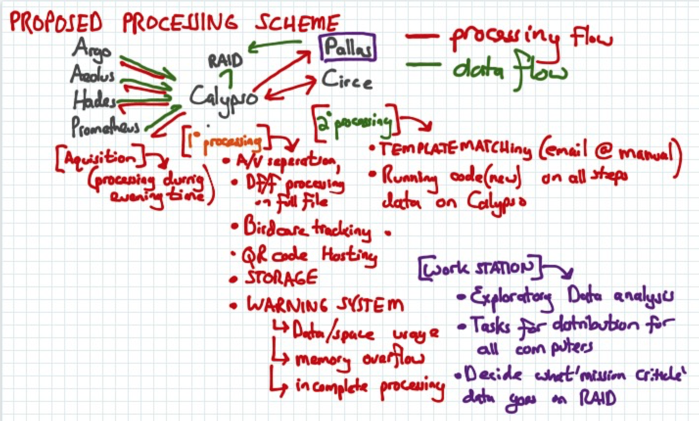
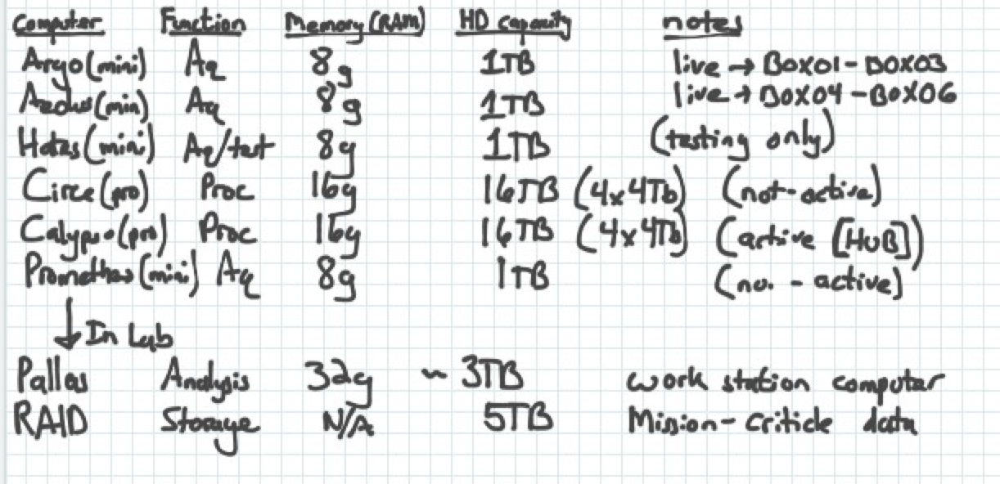

# ARGO IMAGING PIPELINE
ARGO is the behavioral imaging rig in the Gardner Lab, that contains 12 boxes for awake-behaving imaging, and tool prototyping. This repository is for the support code that is used for keeping track of the birds in the rig, and distributes data for pre-processing, then collects it for exploratory analysis.

This is the documentation for the Automated 'middle analysis' portion, and modules of the analysis pipeline. This will typically not be "cron'd" but reserves the ability to be.

#### BACKGROUND (preprocessing on other computers)

Data exists in Circe in this format:

    DATA--> PROC--> BIRD_ID--> DATE--> RAW-->mat
                                |--> gif

The specifications of the computers in the workflow are as follows:

## MIDDLE-PROCESSING OVERVIEW

In brief:
1. (OPTIONAL) down-sampled Df/f (DS avi) videos of the unaligned data will be created.

2. the data for each bird will be aligned to song

3. ROI maps will be automatically determined

4. 'agnostic' ROI extraction will occur. This requires within-day image alignment

5. 'gnostic' ROI extraction will occur for n-(x) days, determined by extraction parameters read in a text file, merging highly overlapping ROIs. This requires within and across day image registration.

6. full resolution Df/f MTIFF for analysis in THUNDER

7. Reorganization: All ROI data will be stored in a separate directory, by BIRD_ID, for easy processing

### DATA TRANSFER AND PARSING

The entire directory, from PROC forward, will transfer to data processing computers. The active directory is the mat folder. In the BIRD-ID dir, a TEMPLATE file is stored, that is the BOS recored through the head-mounted mic

Within the 'mat' folder, an additional folder, 'extraction' will be created, where song-aligned .mat files will be created. A text alert warns the user to manually cut the song cluster.

#### Functions and descriptions
AR_DATA_UPDATE() - Copy new data from pre-processing computer to MIDDLE-PROCESSING computer. Also Backs up raw data.

AR_Batch_Dff(BIRD_ID, varargin) - Create Df/f on all days of this bird. Can output tif/avi or to DS.

AR_TemplateSelect() - Pick a template to run batch template processing on. Run in dir.

AR_TemplateMatch(BIRD_ID) - align to song, using stored template

AR_ROI_Extraction_A(BIRD_ID, varargin) - Extract ROIs (agnostically)

AR_ROI_Extraction_B(BIRD_ID, varargin) - Extract ROIs (gnostically)
