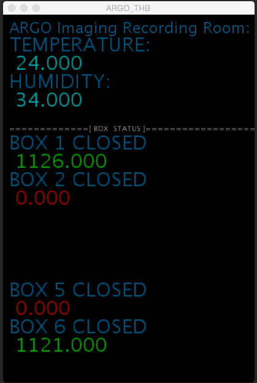

# ARGO
ARGO is the behavioral imaging rig in the Gardner Lab, that contains 12 boxes for awake-behaving imaging, and tool prototyping. This repository is for the support code that is used for keeping track of the birds in the rig, and distributes data for pre-processing, then collects it for exploratory analysis.

## STAGE ONE: DATA COLLECTION

### Collect data from 3 acquisition computers, plus one support computer
  ARGO (MAC Mini): BOX01- BOX04

  CALYPSO (MAC Mini): BOX05-BOX08

  CALLIDICE (MAC Mini): BOX09-BOX12

  CIRCE (MAC pro): Support, data staging and distribution.

### Temperature, Humidity, Social Time Tracker
CIRCE outputs one .csv per day that includes Temperature, Humidity as and the BOX door status for each 'active' BOX in the rig, sampled and timestamped every 2 seconds. Aggregate_Data will also record a column for the name of the bird in each BOX.

### STAGE TWO: DATA PARSING

CIRCE runs a MATLAB script once per day, that will gather data from acquisition computers, pre-process the incoming .mov files (seperate audio/video) and distribute them to a host RAID for future analysis. 

STATUS Page updates the current status of all Data collected over the past several days, and will update with graphs for each BOX that is active.
