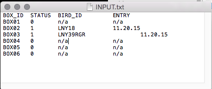
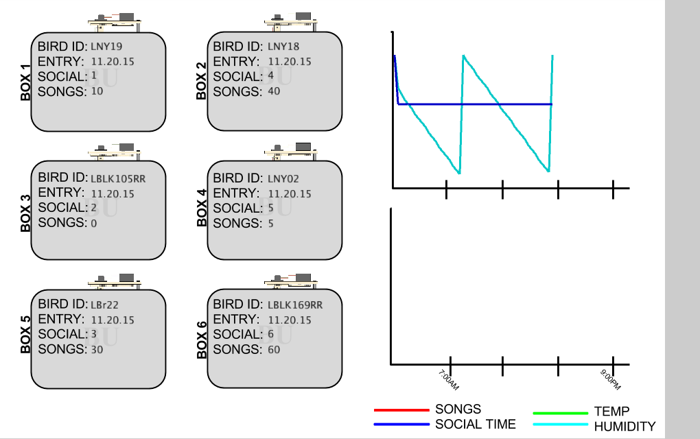
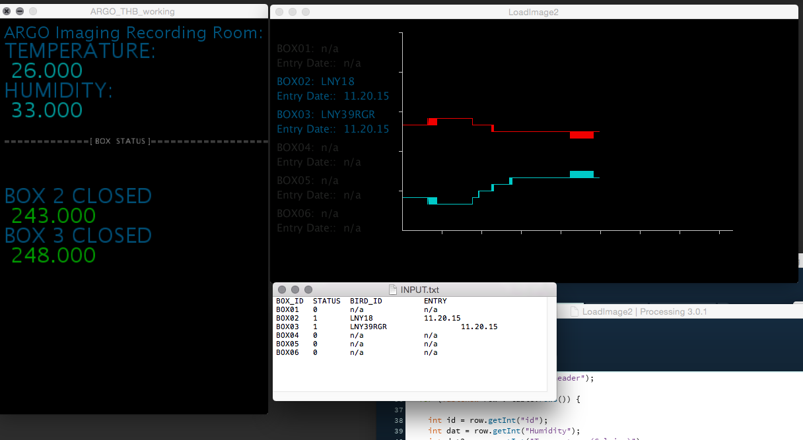

# ARGO
ARGO is the behavioral imaging rig in the Gardner Lab, that contains 12 boxes for awake-behaving imaging, and tool prototyping. This repository is for the support code that is used for keeping track of the birds in the rig, and distributes data for pre-processing, then collects it for exploratory analysis.

## STAGE ONE: DATA COLLECTION

### Collect data from 3 acquisition computers, plus one support computer
  ARGO (MAC Mini): BOX01- BOX04

  CALYPSO (MAC Mini): BOX05-BOX08

  CALLIDICE (MAC Mini): BOX09-BOX12

  CIRCE (MAC pro): Support, data staging and distribution.


### Temperature, Humidity, Social Time Tracker
CIRCE outputs 2 .csv files:
1. One .csv per day that includes Temperature, Humidity as and the BOX door status for each 'active' BOX in the rig, sampled and timestamped every 2 seconds.
2. A .csv called 'Aggregate_Data' that includes the Max/Min Temperature, Humidity, as well as social time for each box, and what bird is in each box.

#### experiment status
experiment status is defined by a .tsv text file, and is used to get bird's IDs that are in each BOX. This can be changed on the fly, and it constantly updates all monitoring and logging programs.


### MONITOR DATA

#### AGRO Console
At the rig, there is a console/badge that tacks the box door status, as well as the current T/H. This badge notifies the user of what boxes are actively being monitored.  

Tracking the Current Box Stats, Social Time and current Temperature/Humidity:


Tracking BIRD ID in each active box, and Temperature/Humidity through out the course of the day:


#### Remote Console
To keep track of active data collection at the bench, or during analysis, a brief history of Temperature, Humidity and # of songs collected can be monitored in real time via a constantly uploaded/hosted image, that is accessible via a QR code on each box, or with the proper hyerlink. This image refreshes everyday, and can be saved for each day for reference (raw data is stored in .csv described above)




Example of console on desktop:



### STAGE TWO: DATA PARSING

 CIRCE runs a MATLAB script once per day, called:
```
>> AR_DataTransfer
```


...that will gather data from acquisition computers, pre-process the incoming .mov files (seperate audio/video) and distribute them to a host RAID for future analysis.
