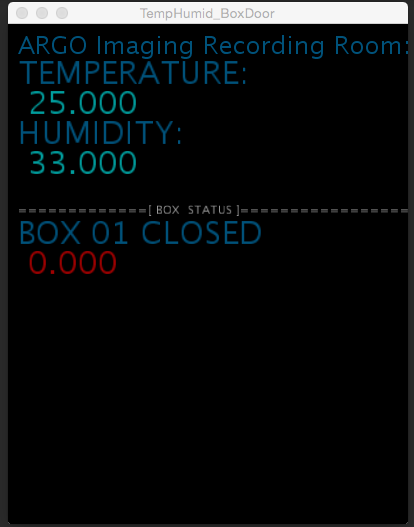
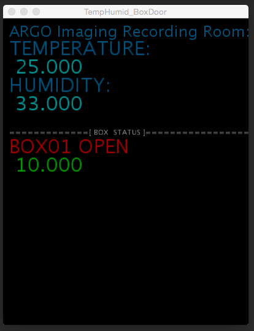
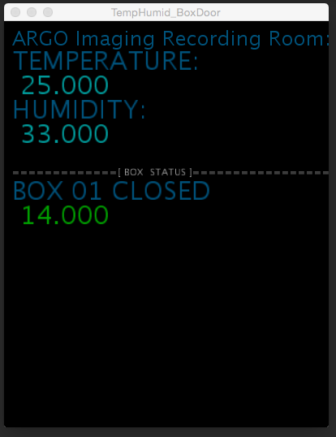

# ARGO
ARGO is the behavioral imaging rig in the Gardner Lab, that contains 12 boxes for awake-behaving imaging, and tool prototyping. This repository is for the support code that is used for keeping track of the birds in the rig.

## Temperature and Humidity Tracker

